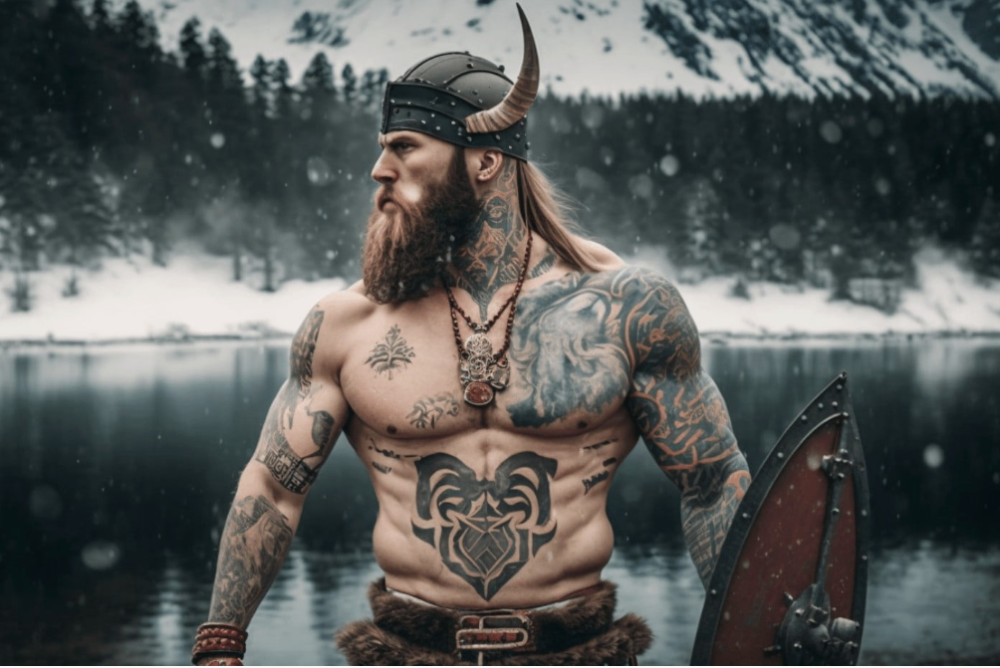

# Северный Воин - Фитнес-клуб в стиле викингов



## Описание проекта
Фитнес-клуб "Северный Воин" - это уникальный веб-сайт, разработанный в скандинавском стиле, предлагающий тренировки по методикам древних викингов. Сайт включает в себя информацию о клубе, услугах, тренерах и контактные данные.

## Авторские права
© 2023 Zotowsky. Все права защищены.  
**Это мой оригинальный проект. Любое копирование, распространение или использование материалов сайта без моего разрешения запрещено.**

## Особенности
- Адаптивный дизайн
- Модальное окно авторизации/регистрации
- Стилизованные элементы в скандинавском стиле
- Интерактивная контактная форма

## Технологии
- HTML5
- CSS3
- JavaScript (для модальных окон)

## Установка
1. Клонировать репозиторий:
   ```bash
   git clone [ссылка на репозиторий]
